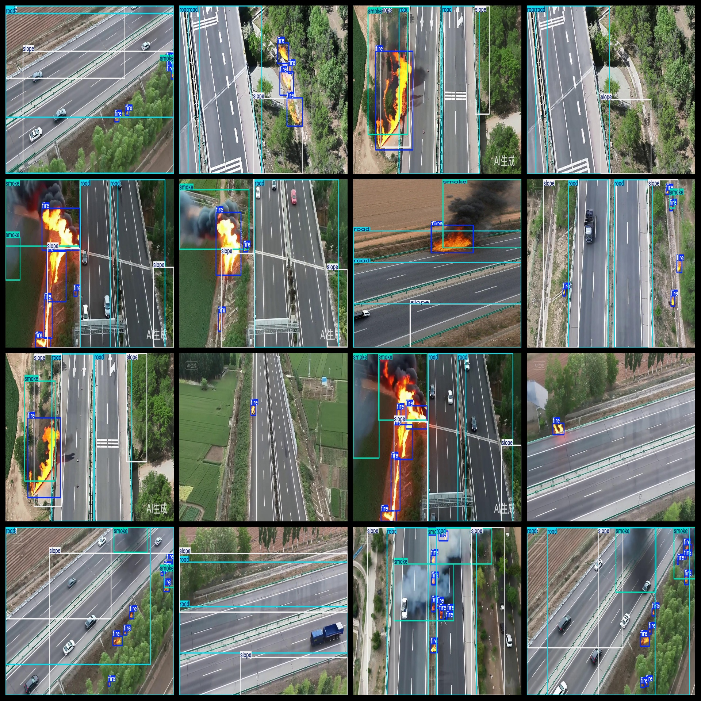

# Aerial Highway and Surrounding Smoke and Fire Dataset
144 images, VOC+YOLO

The dataset format is Pascal VOC format + YOLO format (without the split path's txt file, only containing jpg images along with corresponding VOC format xml files and yolo format txt files).

Number of images (jpg files): 144

Number of annotations (xml files): 144

Number of annotations (txt files): 144

Number of categories: 4

Repository location: datasets_sl

Annotation category names: ["fire", "road", "slope", "smoke"]

"Fire" "Road" "Slope" "Smoke"

Each category number of boxes:

Fire box count = 441

Road box count = 224

Slope box count = 200

Smoke box count = 127

Total box count: 992

Each category occupied image count:

Fire occupied image count = 129

Road occupied image count = 113

Slope occupied image count = 112

Smoke occupied image count = 89

Image resolution: 1248x704

Using labeling tool: labelImg

Dataset enhancement: No

Annotation rules: Draw a box around the category

Important note: The dataset does not have been divided into training validation test sets; you need to do it yourself.

Special declaration: This dataset does not guarantee any accuracy on the trained model or weight files.

Annotation & Image situation as follows:
## Images

---

Here is a pay link on Stripe (https://buy.stripe.com/3cs8yP7sY87d0vu9AB). Please contact me lonlonago@foxmail.com after funding $89, and I will send you a complete data files, thank you!

